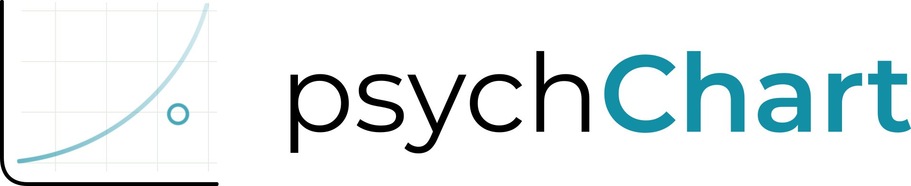

<p align="center">
  
</p>

<p align="center">
  A Python package for generating psychrometric charts using declarative, YAML-driven configuration.
</p>

---

## What psychChart does

psychChart builds reproducible psychrometric diagrams from configuration files. It separates:

- physical psychrometric calculations;
- index computation, such as ITU/THI-like fields;
- semantic profiles, labels and colors;
- visualization layers;
- optional operational decision overlays.

This separation keeps scientific calculations auditable while allowing different visual and semantic interpretations to be configured without changing the core code.

---

## Installation for development

From the repository root:

```bash
python -m pip install -e ".[dev]"
```

Optional interfaces can be installed with:

```bash
python -m pip install -e ".[app]"   # Streamlit app
python -m pip install -e ".[api]"   # FastAPI backend
```

For Parquet input files:

```bash
python -m pip install -e ".[parquet]"
```

---

## Quick validation

Run the test suite:

```bash
pytest
```

Render a few validated examples:

```bash
psychchart examples/itu_field_labels.yaml
psychchart examples/operational_overlay_minimal.yaml
psychchart examples/thermal_trajectory_classified.yaml
psychchart examples/bovine_bioclimatic_final_azevedo.yaml
```

Examples should be executed from the repository root because example YAML files use repository-relative data paths.

---

## Quick usage

### CLI

```bash
psychchart examples/bovine_bioclimatic_final_azevedo.yaml
```

### Streamlit app

```bash
python -m pip install -e ".[app]"
psychchart-app
```

### API

```bash
python -m pip install -e ".[api]"
uvicorn psychchart.api.fastapi_app:app --reload
```

---

## Python usage

```python
from psychchart import PsychChart, load_chart_config

cfg = load_chart_config("examples/itu_field_labels.yaml")
chart = PsychChart(**cfg)
chart.draw()
chart.fig.savefig("chart.png", dpi=200)
```

---

## Validated examples

The main validated examples are listed in `examples/README.txt` and covered by smoke tests.

Useful starting points:

```bash
psychchart examples/example_points.yaml
psychchart examples/example_mixed.yaml
psychchart examples/itu_field_labels.yaml
psychchart examples/operational_overlay_minimal.yaml
psychchart examples/bovine_bioclimatic_final_azevedo.yaml
```

Historical material is kept under `examples_old/` and is not part of the validated example set.

---

## Index field labels

Continuous index fields can display their semantic class labels directly inside the psychrometric diagram. The index semantics remain defined at the index level through `levels`, `colors`, and `labels`; the nested `render.field.labels` option only controls whether those labels are drawn inside the field.

```yaml
indexes:
  - index: ITU
    label: "Temperature-Humidity Index (ITU)"
    levels: [50, 63, 75, 79]
    colors: ["#1a9850", "#fee08b", "#fdae61"]
    labels: ["Comfort", "Alert", "Stress"]
    render:
      field:
        alpha: 0.70
        colorbar: false
        labels: true
        label_fontsize: 22
        label_color: "#222222"
        label_alpha: 0.85
        label_fontweight: bold
        label_rotation: -15
```

Manual positions may be declared either in chart coordinates (`t`/`w`) or in dry-bulb temperature and relative humidity coordinates (`t`/`rh`). Relative humidity accepts both fractions and percentages.

```yaml
render:
  field:
    labels: true
    label_positions:
      - label: "Comfort"
        t: 18
        rh: 60
      - label: "Alert"
        t: 26
        rh: 0.70
      - label: "Stress"
        t: 34
        w: 0.020
```

Complete example:

```bash
psychchart examples/itu_field_labels.yaml
```

---

## Operational overlays

Operational overlays turn the chart into a decision-support visualization. They project a declared management policy over the psychrometric domain for a selected accumulated-load class and trend.

```yaml
operational_overlays:
  - load_class: A2
    trend: steady
    alpha: 0.20
    show_boundaries: true
    show_legend: true
```

When no profile is declared, psychChart injects the built-in `dairy_cooling_default` profile. Custom operational policies can be declared in `operational_profiles`.

Complete example:

```bash
psychchart examples/operational_overlay_minimal.yaml
```

Detailed documentation:

```text
docs/OPERATIONAL_OVERLAYS.md
```

---

## Architecture

psychChart is structured as a modular system:

```text
CORE (physics + rendering)
    ↑
SERVICES (application layer)
    ↑
INTERFACES:
  - CLI
  - Streamlit
  - FastAPI
```

The internal design follows the same scientific separation used in the documentation: observations, psychrometric transformations, indexes, semantic profiles and rendering remain independent layers.

---

## API usage

### Render chart as JSON

```http
POST /render
```

Response:

```json
{
  "format": "png",
  "media_type": "image/png",
  "data_base64": "..."
}
```

### Render chart as file

```http
POST /render/file
```

Returns binary image output.

---

## Documentation

- `docs/api_usage.md`
- `docs/BOVINE_BIOCLIMATIC_CHART.md`
- `docs/OPERATIONAL_OVERLAYS.md`
- `examples/README.txt`
- `CHANGELOG.md`

---

## License

LGPL-3.0
